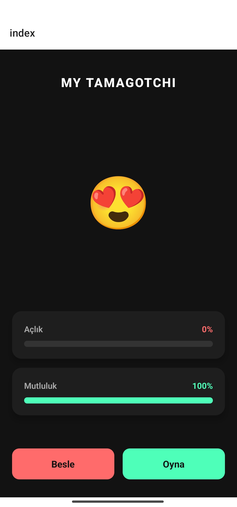

# 🐾 Dijital Evcil Hayvan (Tamagotchi) - React Native Projesi

Bu proje, Mobil Uygulama Geliştirme dersi kapsamında, temel React Native kavramlarını (JSX, Component, Props, State) uygulamak ve AI (Yapay Zeka) araçlarını bir **"Senior Developer"** mentörlüğünde kullanarak geliştirilmiştir.

## 🚀 Proje Özellikleri
- **Dinamik State Yönetimi:** Açlık ve mutluluk değerleri anlık olarak takip edilir.
- **Modern UI/UX:** Dark Mode temalı, kart yapısına sahip profesyonel arayüz.
- **Koşullu Render:** Evcil hayvanın modu, stat değerlerine göre dinamik emojilerle değişir.
- **Görsel Geri Bildirim:** Sayısal değerler yerine renkli ilerleme çubukları (Progress Bars) kullanılmıştır.

## 🛠️ Kullanılan Teknolojiler
- **React Native / Expo** (Core Components)
- **TypeScript** (Tip güvenliği için)
- **AI Mentorship:** Yapay zeka ile kod refactoring ve UI iyileştirmesi yapılmıştır.

## 🤖 AI Prompt ve Öğrenim Süreci
Proje geliştirilirken AI asistanına şu kritik "Senior Developer" promptu verilmiştir:
> *"Şu an elimde çalışan temel bir index.tsx kodu var. Senden bu kodu modern bir UI/UX tasarımına kavuşturmanı, ProgressBar yapısı eklemeni ve Clean Code prensiplerine göre bileşenlere (sub-components) ayırmanı istiyorum."*

### 🧠 Öğrendiğim Kritik Detay:
> **Öğrendiğim Detay:** Senior Developer promptu sayesinde, büyük bir kod bloğunu yönetilebilir küçük parçalara ayırmanın (**Component-Based Architecture**) kodun okunabilirliğini ve bakımını ne kadar kolaylaştırdığını gördüm. Ayrıca, `StyleSheet` kullanarak stilleri mantıksal bir yapıda tutmanın projeyi basit bir ödevden "gerçek bir ürün" seviyesine taşıdığını deneyimledim.

## 📸 Ekran Görüntüsü
*()*
